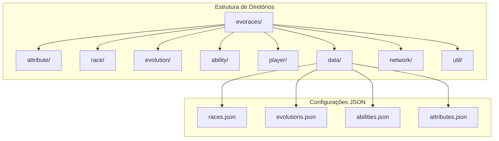
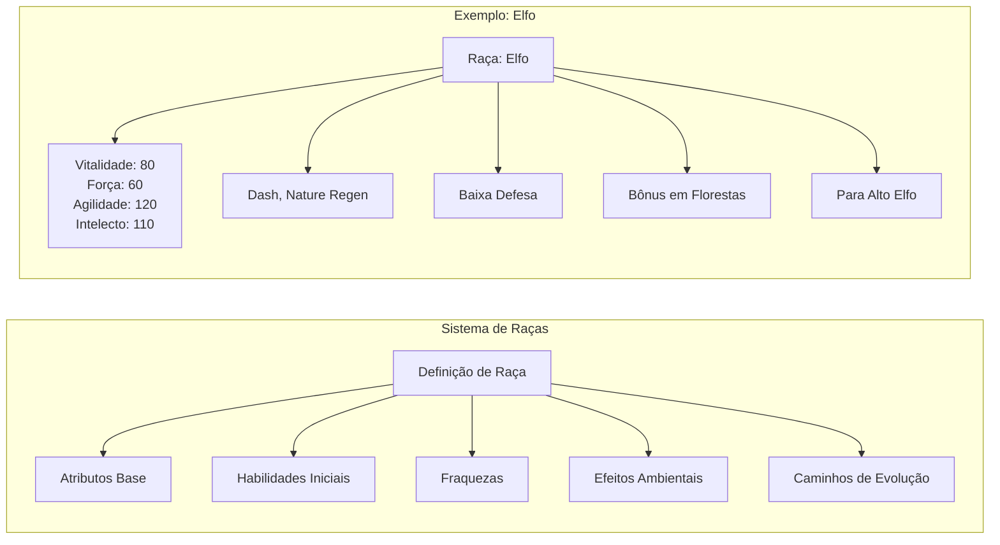
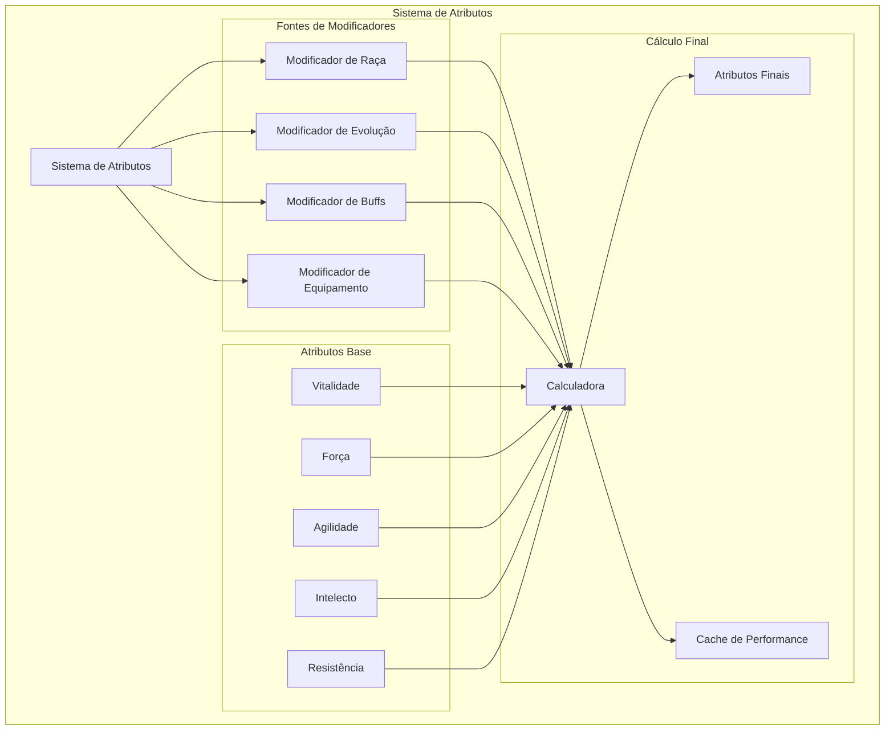
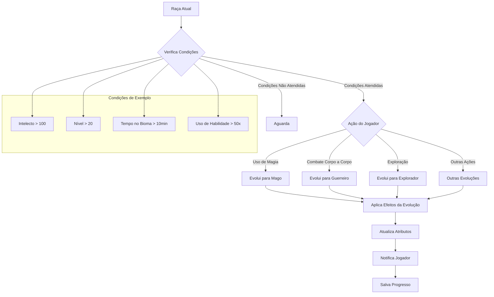
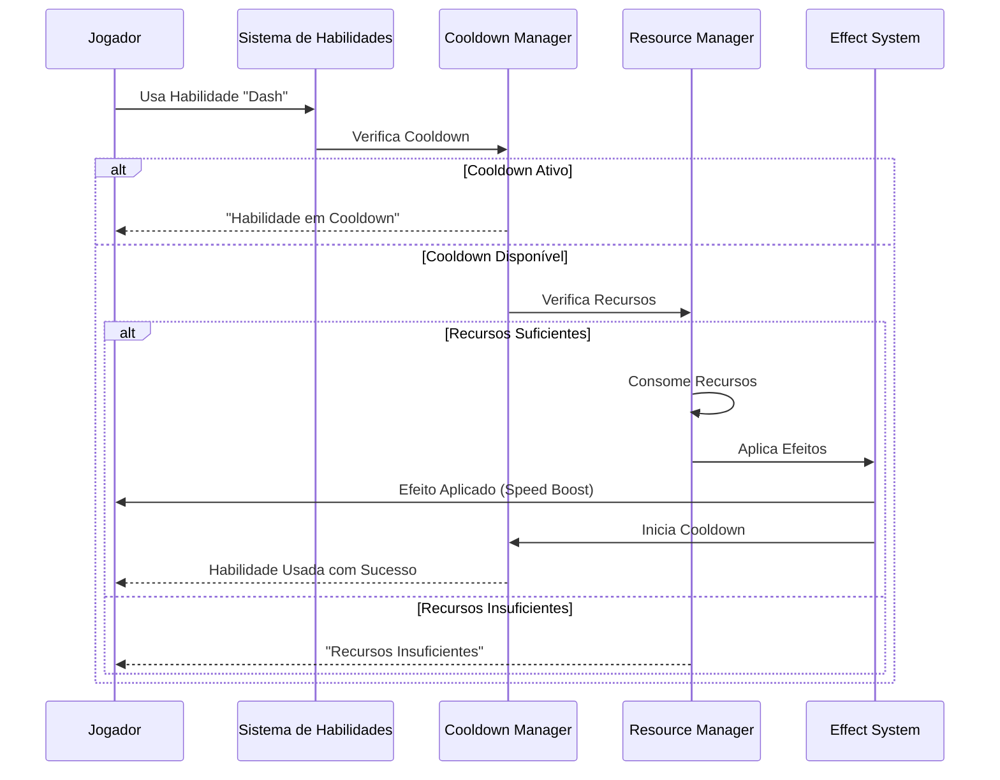
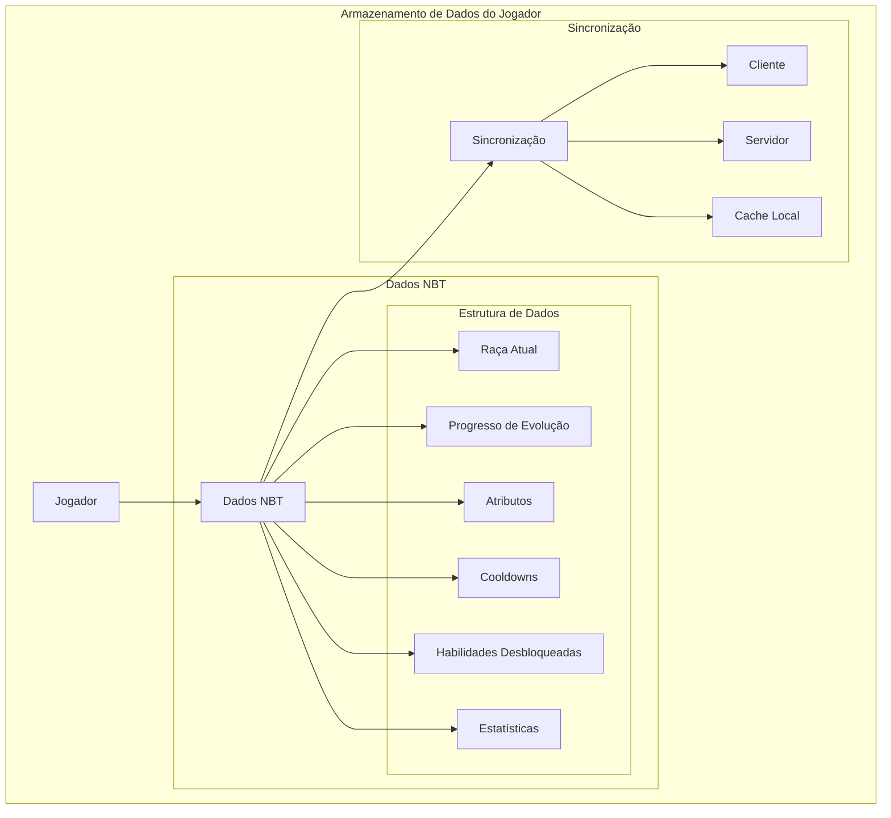
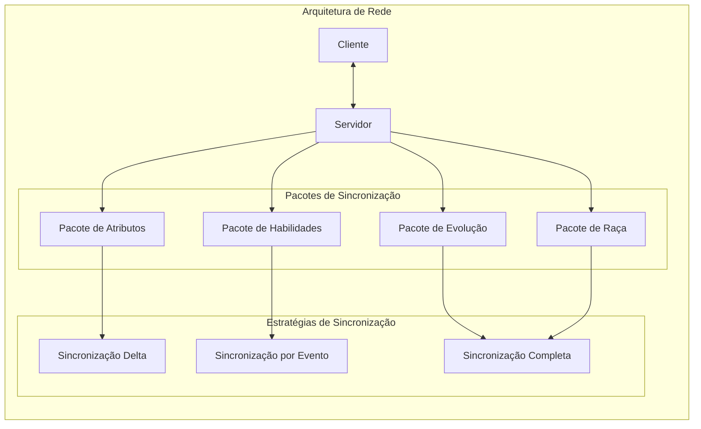
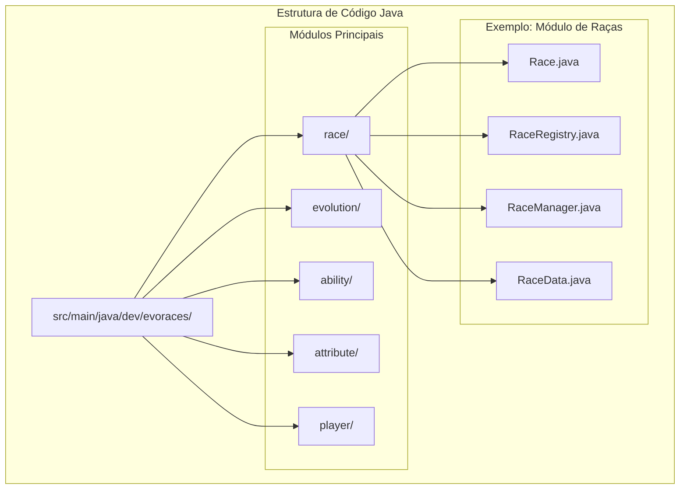
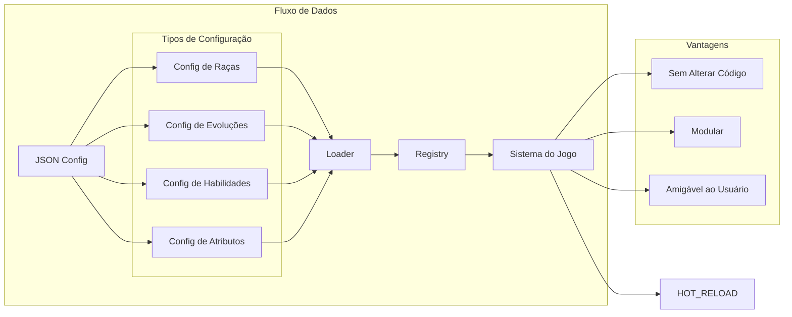
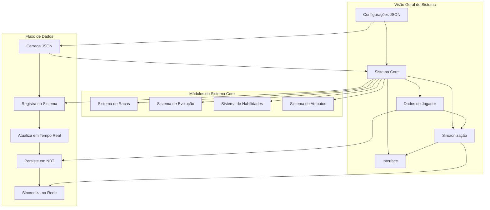

# EvoRaces

Sistema de raças, evolução e habilidades para Minecraft (Fabric), focado em **gameplay profunda**, **performance** e **extensibilidade simples baseada em dados**.

---

## 🎯 Objetivo

Adicionar ao jogo um sistema de:

* Raças com vantagens e desvantagens reais
* Evolução baseada em ações do jogador
* Habilidades ativas com cooldown
* Atributos customizados
* Progressão com builds diferentes

Tudo isso mantendo **leveza**, **compatibilidade** e **facilidade de manutenção**.

---

## 🧱 Arquitetura (Simplificada e Viável)

O mod segue uma abordagem **modular e orientada a dados**, evitando complexidade desnecessária.



```
evoraces/
├── attribute/      # Sistema de atributos
├── race/           # Definição de raças
├── evolution/      # Sistema de evolução
├── ability/        # Habilidades ativas
├── player/         # Dados do jogador
├── data/           # Configurações JSON (raças, habilidades, etc)
├── network/        # Sincronização cliente/servidor
└── util/           # Utilidades gerais
```

---

## ⚙️ Tecnologias

* Fabric API (1.20+)
* Java 17+
* JSON (configuração de dados)
* NBT (persistência do jogador)

---

## 🧬 Sistemas Principais

### 🧑‍🤝‍🧑 Raças

Cada raça define:

* Atributos base
* Habilidades iniciais
* Fraquezas
* Efeitos ambientais
* Caminhos de evolução



**Exemplo:**

```json
{
  "id": "elf",
  "attributes": {
    "vitality": 80,
    "strength": 60,
    "agility": 120,
    "intellect": 110
  },
  "weaknesses": ["low_defense"],
  "abilities": ["dash", "nature_regen"]
}
```

---

### 📈 Atributos

Sistema customizado com cálculo dinâmico:

* Vitalidade (vida)
* Força (dano)
* Agilidade (velocidade)
* Intelecto (magia/efeitos)
* Resistência (defesa)



Modificadores podem vir de:

* Raça
* Evolução
* Buffs temporários

---

### 🔄 Evolução

Sistema baseado em **condições e comportamento do jogador**.



Exemplos de gatilhos:

* Uso de habilidades
* Bioma
* Horário (dia/noite)
* Combate

**Exemplo:**

```json
{
  "from": "elf",
  "to": "high_elf",
  "conditions": ["intellect > 100", "level > 20"],
  "triggers": ["magic_usage"]
}
```

---

### ⚔️ Habilidades

Cada raça possui habilidades ativas:

* Cooldown
* Custo (energia, vida, etc)
* Efeitos



**Exemplo:**

```json
{
  "id": "dash",
  "cooldown": 5,
  "effects": ["speed_boost"]
}
```

---

### 👤 Dados do Jogador

Armazenados via NBT:

* Raça atual
* Progresso de evolução
* Atributos
* Cooldowns
* Habilidades desbloqueadas



---

## 🌐 Networking

Sincronização simples usando Fabric:

* Atualização de atributos
* Uso de habilidades
* Mudanças de raça/evolução



Sem protocolos customizados complexos.

---

## 🗂️ Estrutura de Código

### Exemplo de organização



```
race/
├── Race.java
├── RaceRegistry.java

evolution/
├── EvolutionManager.java
├── EvolutionCondition.java

ability/
├── Ability.java
├── AbilityManager.java

attribute/
├── Attribute.java
├── AttributeManager.java

player/
├── PlayerData.java
├── PlayerDataManager.java
```

---

## 📦 Data-Driven Design

O mod é extensível via JSON:

* Novas raças → sem alterar código
* Novas habilidades → plugáveis via dados
* Evoluções → configuráveis



---

## 🚀 Roadmap

### MVP (fase inicial)

* [ ] 3 raças
* [ ] sistema de atributos
* [ ] 1 evolução por raça
* [ ] 1 habilidade por raça

### Fase 2

* [ ] árvore de evolução
* [ ] perks/talentos
* [ ] balanceamento

### Fase 3

* [ ] integração com outros mods
* [ ] mais conteúdo
* [ ] otimizações

---

## ⚠️ Filosofia do Projeto

* Evitar overengineering
* Priorizar gameplay sobre arquitetura
* Manter código simples e legível
* Evoluir conforme necessidade real

---

## 🤝 Contribuição

Futuro suporte a:

* Novas raças via JSON
* Expansões modulares
* Integrações com outros mods

---

## 💡 Visão

Criar um sistema de raças que realmente impacte o jogo, onde:

> "a forma como você joga define no que você se torna."


## 📊 Resumo da Arquitetura Visual


---

## 📝 Notas de Implementação

### **Performance**
- Cache de cálculos de atributos // analisar necessidade.
- Sincronização delta para reduzir tráfego de rede
- Carregamento lazy de configurações JSON

### **Extensibilidade**
- Todas as configurações via JSON
- API simples para adicionar novos sistemas
- Hot reload de configurações

### **Manutenibilidade**
- Código modular e bem separado
- Documentação visual com diagramas
- Testes unitários para cada módulo
